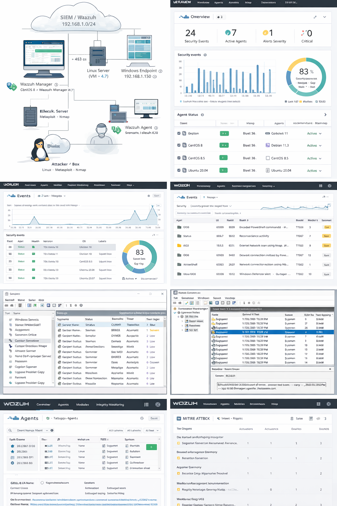

# Blue-team-wazuh-soc-lab

SOC-style Blue Team lab using **Wazuh + Sysmon** to centralize logs, trigger detections, and validate alerts with **MITRE ATT&CK** mapping and evidence.

## Quick navigation
- Setup: `/docs/01-setup/setup-guide.md`
- Architecture: `/docs/02-architecture/architecture.md`
- Detections: `/docs/03-detections/detections.md`
- MITRE mapping: `/docs/04-mitre/mitre-mapping.md`
- Evidence pack: `/docs/05-evidence/evidence-index.md`
- Incident runbooks: `/docs/incident-runbooks/README.md`
- Sysmon config: `/configs/sysmon/sysmon-config.xml`
- PowerShell scripts: `/scripts/powershell/`

## Objectives
- Deploy Wazuh SIEM + agents
- Enable Sysmon telemetry on Windows endpoints
- Create / validate detections and map them to MITRE ATT&CK
- Document evidence (screenshots + event IDs + queries)

## Lab Architecture
- Wazuh Manager: (add VM / IP sanitized)
- Windows Endpoint(s): Sysmon + Wazuh Agent
- Optional: Linux endpoint / attacker box

## Repository structure
- `docs/`
  - `01-setup/setup-guide.md`
  - `02-architecture/architecture.md`
  - `03-detections/detections.md`
  - `04-mitre/mitre-mapping.md`
  - `05-evidence/evidence-index.md`
- `configs/`
  - `sysmon/sysmon-config.xml`
  - `wazuh/README.md`
- `scripts/powershell/`
  - `install-sysmon.ps1`
  - `enable-logging.ps1`
  - `generate-attack-events.ps1`
 
  - ## Incident Response Runbooks

- Runbooks: [/docs/incident-runbooks](/docs/incident-runbooks)

 
  - ## Screenshots (Illustrative)
 
  - > Note: Screenshots in this repository are illustrative (mock).  
    > Real evidence is provided via logs, configs, and reproducible steps under `/docs/` and `/configs/`.
    >
    > This lab is designed to be reproducible on a small VM stack (1 Wazuh manager + 1 Windows endpoint).

## Evidence
See: `docs/05-evidence/evidence-index.md`

## Disclaimer
This repository is sanitized for public publication (no real tokens, passwords, or identifiable production data).
